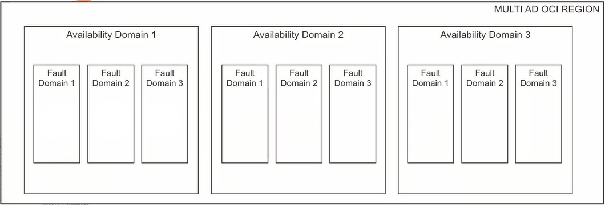

# Arquitetura

## Regions (Regiões)

Áreas geograficamente localizadas, compostas por até 3 Availability Domains (AD).

## Cloud Regions

- A OCI está amplamente distribuída pelo mundo;
- A Oracle possui uma parceria multi-cloud com a Microsoft Azure;
- E também disponibiliza serviço de nuvem híbrida chamada: **Dedicated Region Cloud Customer** 

### Escolha de uma região

#### Localização
- Assim como a escolha de um servidor, a escolha de uma região na OCI leva em conta a distância dos seus usuários;
- Quanto mais próxima dos usuários menor a latência e maior a performance das aplicações. 

#### Data Residency & Compliance
- Muitos países possuem exigências de data residency muito severas;
- E quando se concorda com elas é vital escolher uma região e acordo.

#### Disponibilidade do serviço
- Alguns serviços de cloud são disponibilizados baseados em:
1. Demanda regional;
2. Compliance regulatório;
3. Disponibilidade de recursos;
4. Outros fatores.

## Availability Domains (AD)

- São um ou mais datacenters **tolerante a falhas**, conectados entre si por uma rede de **baixa latência** e **alta largura de banda**;
- São isolados uns dos outros;
- É improvável que falhem ao mesmo tempo;
- Isso porque a estrutura física não é compartilhada (energia, resfriamento, rede interna);
- A falha que impactar um AD é improvável que impacte outro AD.


## Fault Domains (FD)

- Conjunto de hardware e infraestrutura dentro de um AD com o objetivo de fornecer anti-affinity;
- Cada AD possui 3 FDs;
- São como datacenters lógicos;
- Os recursos são habilitados em diferentes FDs e como eles não dividem estrutura física (servidores físicos, racks físicos, switches de rack, unidade de distribuição de energia) é possível obter alta disponibilidade;
- Problemas de disponibilidade causados por mudanças de procedimentos são isolados ao nível do FD; 
- Isso porque em qualquer região da OCI, recursos que estão em no máximo um FD são ativamente trocados a qualquer momento;

**OBS:** é possível controlar a localização das suas instâncias de VM ou DB nos FDs no deploy. Essa estratégia é importante para garantir disponibilidade e resiliência.



## O que isso significa?

- A arquitetura da OCI é projetada para ajudar o usuário a evitar falhas;
- Isso porque a própria estrutura é redundante;
- Mas o usuário também precisa fazer o possível, se aproveitando dessas facilidades, para tornar seus serviços o mais disponíveis possível.

**Exemplo:**


- Nesse exemplo tanto a aplicação quanto o banco de dados estão duplicados em diferentes FDs dentro do mesmo AD;
- Isso adiciona uma camada de redundância, portanto se algo acontecer a um dos FDs tanto a aplicação quanto os dados dela estarão seguros e operando;
- Esse mesmo design também está presentes em outro AD, o que permite ainda mais redundância, disponibilidade e segurança;
- Para que os dados estejam sincronizados em todas as cópias do DB é possível usar diferentes tecnologias como Oracle Data Guard, por exemplo.


**OBS:** mesmo se uma região só tiver um AD ainda assim podemos gerar redundância e segurança pros nossos serviços usando os FDs.


```FD ----> AD ----> Regions```

